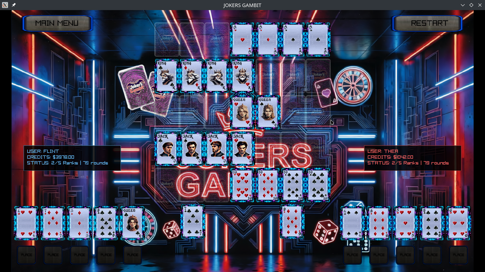
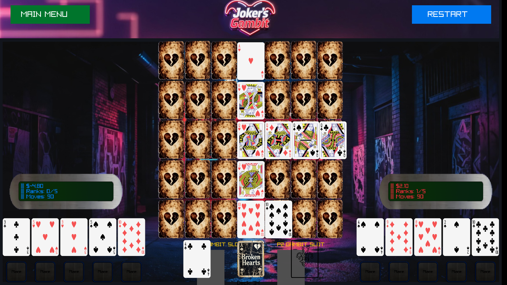
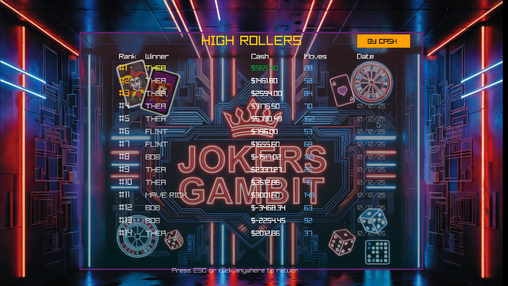

# Joker's Gambit v4.22

  
  
  

**Fast-paced, high-stakes 2-player card game built with raylib**

## Game Mechanics

**Objective:** First to complete **3 out of 5 ranks** (10, J, Q, K, A) wins by filling all 3 suit slots (♣♦♠) on your side of each Hearts keycard.

### Board & Deck
- **5 Hearts keycards** (A♥, K♥, Q♥, J♥, 10♥) fixed center
- **3 slots per rank** per player (P1 left, P2 right)
- **49 cards total:** 47 standard (minus 5 Hearts) + 2 Jokers
- **5-card hands**, refreshed every 3 placement phases

### Round Structure

**1. Discard Phase:** Both players secretly discard 1( card held until placement phase is complete(press continue) then returned to a random place in the deck )

**2. Reveal & Resolve:**

| Discarded Cards | Effect | Rewards/Penalties |
|-----------------|--------|-------------------|
| **Same rank (pair)** | Sweep all incomplete ranks | +$1 each (× multiplier), both draw 1 |
| **One Joker** | Sweep opponent's board | Joker player: -$1, both draw 1 |
| **Two Jokers** | "JOKERS GAMBIT" - sweep both boards + hands | Each: -$1 + $5 (× multiplier) |
| **No match** | Normal play | Both draw 1 |

**3. Placement Phase:** Take turns placing cards in empty slots
- **+$0.10 per placement** (× multiplier)
- **Big bonus** for rank completion
- **Filled ranks are permanent** (immune to sweeps)
- **Discards**: Discarded cards randomly positioned back in deck after round completion/ placement phase over and players press continue

### Scoring
**Multiplier:** 0 ranks = ×1 | 1 rank = ×2 | 2+ ranks = ×4  
**Win Score:** `balance + speed bonus - (balance/2 risk penalty)`

---

## Features
✅ PvP / PvAI / AIvAI modes  
✅ Player accounts & persistent data  
✅ Top-100 leaderboard  
✅ Economy system with multipliers  
✅ 3 AI opponents (Bob, Thea, Flint)  
✅ Sound effects & card textures  
✅ P2 hand cover/uncover setting

### AI Behaviors
- **BOB:** Jokers first → low cards → any
- **THEA:** Fully random
- **FLINT:** Never Jokers, prefers low cards

---

## Future Plans
- **Settings:** AI speed, music toggle (track.mp3), JSON persistence
- **Shop:** Unlock new card decks & avatars (80px circles)
- **Deck switching** in settings
- **Profile pics:** 5 default + unlockables

---

## Current Issues to Fix

### Critical Bugs
1. **AI account assignment broken:** All AI use Bob's logic regardless of selected opponent; player/AI positions swap incorrectly in P2 mode
2. **Discarded cards dealt prematurely:** Cards discarded before placement phase ends are being redealt
3. **Simultaneous discard not working:** P1 must discard first instead of both players/AI discarding simultaneously
4. **Start/restart doesn't require continue:** Discarded cards at game start affect balances incorrectly

### Missing Features

5. **No round cost:** Each continue/round should deduct $1
6. **Continue buttons hidden:** Should be visible at all times (separate for P1/P2)
7. **AI sound effects incomplete:** AI not triggering coin.wav and other sounds properly
8. **Window scaling broken:** Game assets don't scale with window resize; needs centering at 1900×1080 max with black bars

---
